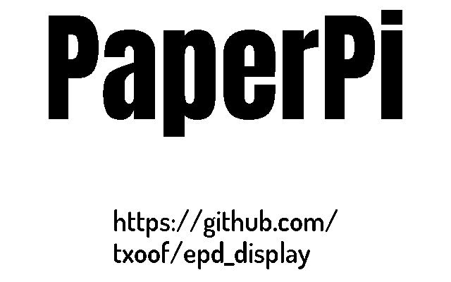

# PaperPi


E-Paper display with multiple display plugins. 

PaperPi is designed run as a daemon process to display a vairety of plugins to SPI based e-paper/e-ink displays with long refresh delays. It has been specifically written to work with the [WaveShare](https://www.waveshare.com/product/displays/e-paper.htm) SPI displays.

PaperPi rotates through a user-configured selection of plugins each represented by a single static "screen." After the plugin screen has "expired", the next plugin with the highest priority (lowest value) will be displayed, eventually cycling through all the plugins.

## Plugins
PaperPi supports many different plugins and layouts for each plugin. The plugin structure is open and documented to allow building your own plugins or customizing existing plugins.
 
[Complete Plugins  List](./documentation/Plugins.md)

| | | |
|:-------------------------:|:-------------------------:|:-------------------------:|
|[LibreSpot (spotify) Plugin](./paperpi/plugins/librespot_client/README.md)|[Word Clock](./paperpi/plugins/word_clock/README.md)|[Logitech Media Server Plugin](./paperpi/plugins/lms_client/README.md)|
|[Decimal-Binary Clock](./paperpi/plugins/dec_binary_clock/README.md)|[Met.no Weather](./paperpi/plugins/met_no/README.md)|[Pi Dashboard](./paperpi/plugins/pi_dash/README.md)|

<a name="requirements"></a>
## Requirements

### Required Hardware
* Raspberry Pi 4B
    - A Pi3 and possibly a Pi Zero are likely sufficient, but are untested at this time (Nov 2020)
* [WaveShare EPD SPI-only Screen](https://www.waveshare.com/product/displays/e-paper.htm) with PiHat
    - see the full list of currently [supported screens](#supportedScreens)
    - UART, SPI/USB/I80 screens are **not supported** as there is no python library for diving these boards
    
     
### Optional Hardware
* [HiFiBerry hat](https://www.hifiberry.com/shop/#boards) (*optional*) 
    * The HiFiBerry DAC+ PRO and similar boards add high-quality audio output to the Pi so it can act as a display and also work as a LMS client player using squeezelite
    * GPIO 2x20 headers **must be added** to the board to support WaveShare HAT
    * HiFiBerry's [DAC+ Bundle](https://www.hifiberry.com/shop/bundles/hifiberry-dac-bundle-4/) with the following configuraiton is a good choice:
        * DAC+ Pro 
        * Acrylic Case for (RCA) AND DIGI+
        * Raspberry Pi 4B 2GB (1GB should be sufficient as well)
        * 16GB SD Card
        * PowerSupply (USB C 5.1V/3A)
        * 2x20 Pin Male Header (required for WaveShare HAT)

### Optional Software
PaperPi plugins work with a variety of other software such as Logitech Media Server and Spotify. Check the [Plugin documentation](./documentation/Plugins.md) for further instructions

## Hardware/OS Setup
The WaveShare displays require SPI access. SPI can be enabled through the `raspi-config` command.
* `$ sudo raspi-config`
| |
|:-------------------------:|
||
||
||


## Intial Setup
PaperPi can run either as a daemon and start at boot, or can run on demand from a user's directory in "single user mode."
1. Download the archive containing the executable and install scripts
2. Decompress the archive: `tar xvzf paperpi.tgz`
3. Launch PaperPi: `./paperpi`
    - On the first run PaperPi will create a configuration file in `~/.config/com.txoof.paperpi/paperpi.ini` and then exit
4. Edit the configuration file to match your needs. The default configuration will provide a reasonable starting point
    - At minimum you must specify the `display_type` 
    ```
    display_type = epd2in7
    ```
    - See the list of [supported screens](#supportedScreens) for more information
5. Launch PaperPi again -- you should immediately see a splash screen followed shortly by the first active plugin.

### Daemon Setup
1. To install PaperPi as a service, run the `install.sh` script. 
    - This will:
        * add the necessary users and groups
        * add a configuration file to `/etc/defaults/paperpi.ini`
        * install PaperPi as a systemd service
2. Edit `/etc/defaults/paperpi.ini` to configure a `display_type` and enable any plugins
3. Start PaperPi: `sudo systemctl restart paperpi` 
    - PaperPi will now start at boot as a systemd service


## Building PaperPi
If you would like to develop [plugins](./documentation/Plugins.md) for PaperPi, you will likely need a working build environment. 

### Requirements:
* python 3.7
* pipenv

1. Clone the repo: `https://github.com/txoof/epd_display.git`
2. Run `build.sh` to create a build environment
    - The build script will create a pipenv environment and prompt you to install necessary libraries
    - if pipenv fails to install Pillow, manually install pillow with `pipenv install Pillow`
3. The build script will then attempt to build a binary of PaperPi using pyintsaller 
    - executables are stored in `./dist/`

## Contributing
PaperPi's core is written and maintained in Jupyter Notebook. If you'd like to contribute, please make pull requests in the Jupyter notebooks. Making PRs to the `.py` files means manually moving the changes into the Jupyter Notebook. 

Plugins can be pure python, but should follow the [guide provided](./documentation/Plugins.md).

See [this gist](https://gist.github.com/txoof/ed4319db317f813b9e500ff190ca4a87) for a quick guide for setting up a jupyter environment on a Raspberry Pi.

<a name="supportedScreens"> </a>
## Supported Screens
All supported waveshare screens are only supported in 1 bit (black and white) mode. Grayscale and color output is not supported at this time.

Some WaveShare screens that support color output will also work with with the non-colored driver. Using the 1 bit driver can yield significantly better update speeds. For example: the `epd2in7b` screen takes around 15 seconds to update, but can be driven by the `epd2in7` driver  in 1-bit mode which takes less than 2 seconds to update.

| WaveShare Screen |
|:-|
| epd1in02  |
| epd1in54  |
| epd1in54_V2  |
| epd1in54b  |
| epd1in54b_V2  |
| epd1in54c  |
| epd2in13  |
| epd2in13_V2  |
| epd2in13b_V3  |
| epd2in13bc  |
| epd2in13d  |
| epd2in66  |
| epd2in7  |
| epd2in7b  |
| epd2in9  |
| epd2in9b_V2  |
| epd2in9bc  |
| epd2in9d  |
| epd3in7  |
| epd4in2  |
| epd4in2b_V2  |
| epd4in2bc  |
| epd5in65f  |
| epd5in83  |
| epd5in83b_V2  |
| epd5in83bc  |
| epd7in5  |
| epd7in5_HD  |
| epd7in5_V2  |
| epd7in5b_HD  |
| epd7in5bc  |
| epd7in5bc_V2  |
| epdconfig  |


